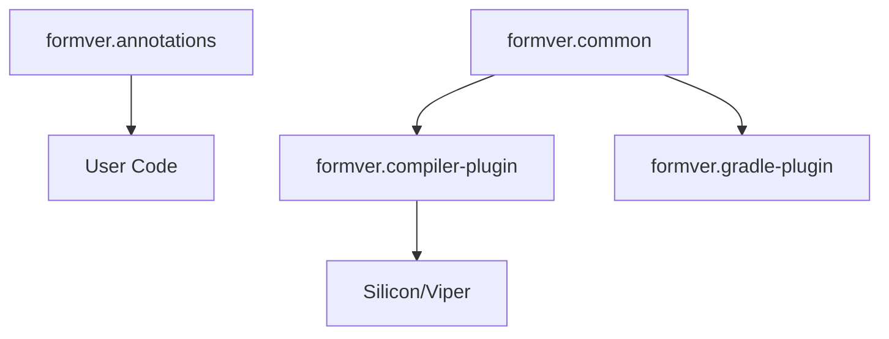

# Architecture Overview

SnaKt is a K2 compiler plugin for Kotlin that performs **formal verification**: it proves mathematically, for all possible inputs, that annotated functions satisfy their specifications. Rather than testing with concrete values, SnaKt uses an SMT solver (Z3) to check all program paths simultaneously.

---

## Why formal verification?

Testing can show the presence of bugs, but it cannot prove their absence. Formal verification fills that gap by:

- **Proving correctness** — postconditions are guaranteed to hold for every possible input satisfying the preconditions, not just tested ones.
- **Finding subtle bugs** — the verifier discovers edge cases (integer overflow paths, missed null checks, aliasing issues) that test suites routinely miss.
- **Making invariants executable** — preconditions and postconditions written in Kotlin source become checked specifications, not just comments.

SnaKt targets Kotlin specifically because of its strong type system, `contract {}` DSL, and widespread use in safety-critical Android and server-side code.

---

## Module architecture



The plugin is organized into four published modules and one internal utility module:

| Module | Role |
|---|---|
| `formver.annotations` | User-facing API: `@AlwaysVerify`, `@Pure`, `@Unique`, `@Borrowed`, `@Manual`; specification DSL functions `preconditions{}`, `postconditions{}`, `loopInvariants{}`, `forAll{}`, `verify()` |
| `formver.common` | Shared configuration types: `PluginConfiguration`, `LogLevel`, `ErrorStyle`, `TargetsSelection`, `UnsupportedFeatureBehaviour`, `ErrorCollector` |
| `formver.compiler-plugin` | The K2 compiler plugin itself; contains the conversion engine, embedding layer, linearizer, Viper AST, Silicon bridge, uniqueness checker, and CLI option parsing |
| `formver.gradle-plugin` | A `KotlinCompilerPluginSupportPlugin` that loads the compiler plugin and forwards Gradle DSL options to it |

### `formver.compiler-plugin` submodules

| Submodule | Role |
|---|---|
| `core` | Conversion engine: `conversion/`, `embeddings/`, `linearization/`, `names/`, `domains/`, `purity/` |
| `plugin` | K2 integration: `ViperPoweredDeclarationChecker` registered as a `FirDeclarationChecker` |
| `viper` | Viper AST node definitions and the Silicon/Z3 bridge |
| `uniqueness` | Standalone ownership analysis (`UniqueDeclarationChecker`, `ContextTrie`) |
| `cli` | Command-line option parsing |

---

## High-level verification flow

```
Kotlin Source (.kt)
      │
      ▼
  K2 Frontend (FIR AST)
      │
      ▼  ViperPoweredDeclarationChecker.check()
  ProgramConverter
      │  (one per compilation unit)
      ▼
  FunctionEmbedding / ExpEmbedding tree
      │  (embedding layer: typed, Viper-independent IR)
      ▼
  Linearizer + SsaConverter
      │  (lower to Viper AST; introduce SSA variables)
      ▼
  Viper AST (Method / Function / Field / Domain nodes)
      │
      ▼  Verifier.verify()
  Silicon (Viper verifier)
      │
      ▼
  Z3 (SMT solver)
      │
      ▼
  VerificationResult (success | error list)
      │
      ▼  VerifierErrorInterpreter
  Kotlin diagnostics at source locations
```

Each stage is described in detail in [Pipeline](pipeline.md).

---

## Key design patterns

### Context objects

The compiler plugin passes a hierarchy of context objects through the conversion process rather than using global state or singletons. Each context carries the services available at that scope:

- `ProgramConversionContext` — program-level: class registry, name producers, configuration.
- `MethodConversionContext` — method-level: parameter bindings, return type, contract embeddings.
- `StmtConversionContext` — statement-level: local variable scope, current label stack, fresh entity producers.

This layered design makes it straightforward to test components in isolation and avoids implicit coupling.

### Visitor pattern

All expression-tree traversal uses `ExpVisitor<R>`, a generated interface with one `visitX` method per `ExpEmbedding` subtype. Node types implement `accept(v)` and dispatch to the correct visitor method. This eliminates `when (embedding is ...)` chains in traversal code and allows new traversals (purity, debug printing, linearization) to be added without touching node definitions.

### Sealed interface hierarchies

`ExpEmbedding`, `TypeEmbedding`, `PretypeEmbedding`, `FunctionEmbedding`, `TypeInvariantEmbedding`, and `SpecialKotlinFunction` are all sealed interfaces or classes. This gives the Kotlin compiler exhaustive `when` checks across the entire embedding hierarchy, catching missed cases at compile time.

### Fresh entity generation

`FreshEntityProducer<T, K>` is a generic factory that produces fresh, uniquely-named instances. Used for:
- Anonymous temporary variables during linearization.
- Fresh SSA variable versions.
- Fresh labels for synthetic control flow.

### Lazy initialization

`ClassTypeEmbedding` separates *creation* from *initialization* of class embeddings. Classes are registered by name when first referenced and fully initialized (fields, supertypes, predicates) in a later pass. This allows mutually-recursive type hierarchies to be handled without requiring a specific processing order.

### Error aggregation

The `ErrorCollector` interface accumulates all diagnostics during a conversion pass rather than throwing on the first error. This ensures users see all verification failures from a single compilation, not just the first one encountered.

### Annotation-driven control

Verification is opt-in. Functions are verified only when annotated with `@AlwaysVerify` (or when `TargetsSelection` is configured to `all_targets`). The `@Pure` annotation controls whether a function is translated to a Viper `function` (usable in specifications) or a Viper `method`. The `@Unique` and `@Borrowed` annotations control ownership tracking.

### Scoped name resolution

All Viper names are derived from Kotlin names using a scope-qualified mangling scheme (see [Name Mangling](name-mangling.md)). `ScopedKotlinName`, `NameScope`, and `FreshEntityProducer` cooperate to produce globally unique Viper identifiers even when Kotlin allows shadowing within the same scope.
