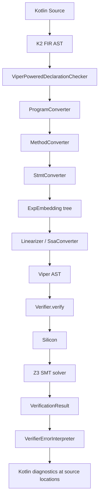

# Conversion Pipeline

This page traces a Kotlin function annotated with `@AlwaysVerify` through each stage of SnaKt's verification pipeline, from source code to a Z3 result and back to Kotlin diagnostics.

---

## Pipeline overview

---

## Stage 1: FIR to Embeddings

The K2 frontend produces a **FIR AST** (Frontend Intermediate Representation). SnaKt hooks into this via `ViperPoweredDeclarationChecker`, a `FirDeclarationChecker<FirSimpleFunction>` registered in the plugin's `FirExtensionRegistrar`.

When the K2 type-checker visits a function declaration, `ViperPoweredDeclarationChecker.check()` is called. It delegates to `ProgramConverter`, which coordinates the entire conversion process for a compilation unit.

### ProgramConverter

`ProgramConverter` maintains a registry of all known class and function embeddings for the program. For each function selected for verification it creates a `MethodConverter`.

### MethodConverter

`MethodConverter` handles one function at a time. It:

1. Creates parameter embeddings (`PlaceholderVariableEmbedding`) for each FIR value parameter.
2. Resolves the return type into a `TypeEmbedding`.
3. Invokes `StmtConversionContext.convertFunctionWithBody` on the FIR function body.

### StmtConversionContext and StmtConversionVisitor

`StmtConversionContext` is the core context object for statement-level conversion. It exposes services needed during traversal:
- The local variable scope (mapping FIR symbols to `FirVariableEmbedding`).
- Fresh variable and label producers.
- The current function's return label.
- Access to class/function registries from the enclosing `ProgramConversionContext`.

`StmtConversionVisitor` is a `FirVisitor` that maps FIR statement and expression nodes to `ExpEmbedding` nodes. Key mappings:

| FIR node | ExpEmbedding |
|---|---|
| `FirBlock` | `Block` |
| `FirWhenExpression` | `If` (binary) or `While` (when over boolean) |
| `FirWhileLoop` | `While` |
| `FirReturnExpression` | `Return` |
| `FirFunctionCall` | `MethodCall` or `FunctionCall` or special embedding |
| `FirVariableAssignment` | `Assign` |
| `FirProperty` | `Declare` |
| `FirQualifiedAccessExpression` | `FieldAccess`, `FirVariableEmbedding`, or function call |
| `FirStringConcatenationCall` | `AddStringString` / `AddStringChar` chain |
| `FirTypeOperatorCall` | `Is`, `Cast`, `SafeCast` |
| `FirLiteralExpression` | `IntLit`, `BooleanLit`, `CharLit`, `StringLit`, `NullLit` |

`convertFunctionWithBody` is the entry point that drives the visit, then hands the resulting `ExpEmbedding` tree to `checkValidity` (structural checks) and, if the function is `@Pure`, to `isPure()` before linearization.

---

## Stage 2: Embeddings to Viper

The `ExpEmbedding` tree is lowered to Viper AST nodes by `Linearizer` (for impure functions) or `PureLinearizer` (for `@Pure` functions).

### Linearizer

`Linearizer` operates through a `SeqnBuilder`: it walks the embedding tree calling `toViperUnusedResult` / `toViperStoringIn` on each node, accumulating Viper statements into a `Seqn` (statement sequence). Each node's mixin trait (`DirectResultExpEmbedding`, `StoredResultExpEmbedding`, etc.) dictates how it contributes to the sequence.

### SeqnBuilder

`SeqnBuilder` is a mutable builder for a `Seqn`. It tracks the list of local variable declarations and the list of statements emitted so far. After linearization, it is finalized into a `viper.silver.ast.Seqn`.

### What happens during linearization

- **Fresh temporaries**: Complex sub-expressions that cannot be inlined into a single Viper expression are assigned to fresh anonymous variables (created by `SharedLinearizationState.freshAnonVar`).
- **Permission insertion**: Before each field read or write, `FieldEmbedding.accessPolicy` determines the required permission level; the linearizer inserts the appropriate `acc(...)` assertions.
- **Predicate folding/unfolding**: When a field is accessed behind a class predicate, the linearizer emits `unfold` before the access and `fold` after.
- **SSA conversion**: Each assignment to a Kotlin local variable creates a new SSA version (see [SSA](ssa.md)).
- **Contract emission**: Preconditions and postconditions are lowered to Viper `requires` and `ensures` clauses.

### SsaConverter

`SsaConverter` is invoked during linearization of `@Pure` functions to produce SSA-form Viper `let`-binding chains. For statement-based functions, SSA versioning is handled inline by `SharedLinearizationState` through `FreshEntityProducer`.

---

## Stage 3: Viper to Silicon

The assembled Viper AST is submitted to `Verifier.verify()`.

### IntoSilver serialization

SnaKt's Viper AST nodes are data classes in the `viper` submodule. Each implements `IntoSilver`, converting them to `viper.silver.ast.*` JVM objects that Silicon can consume directly. This serialization step produces the `viper.silver.ast.Program` that is handed to Silicon.

### Silicon and Z3 interaction

Silicon is a symbolic execution engine for Viper. It:
1. Unfolds method bodies along all execution paths.
2. At each program point, builds a path condition.
3. Queries Z3 (via the text-based `z3` binary, identified by the `Z3_EXE` environment variable) to check that all assertions hold under the path condition.

Silicon requires Z3 version 4.8.7. SnaKt uses the text-based interface (not the API JAR).

### VerificationResult

Silicon returns a `VerificationResult`: either `Success` or a list of `AbstractVerificationError` values, each carrying a Viper-level error location and a human-readable reason.

---

## Stage 4: Error mapping

`VerifierErrorInterpreter` translates each Silicon error back to a Kotlin source location. The mapping uses two pieces of information:

1. **Viper position**: Each Viper AST node carries a `viper.silver.ast.Position` derived from the `KtSourceElement` that was active when the embedding was created (via `WithPosition` wrappers in the embedding tree).
2. **SourceRole tags**: `ExpEmbedding.sourceRole` carries a `SourceRole` that records the *purpose* of the embedding (e.g., `ReturnsEffect.Wildcard` for a `returns(...)` contract effect). The interpreter uses these tags to produce user-friendly diagnostic messages.

The resulting errors are reported through `ErrorCollector` as K2 diagnostics, appearing in the IDE and in `kotlinc` output at the exact Kotlin source line where the violated contract or assertion appears.

---

## Inline function expansion

Functions marked `inline` in Kotlin are handled by `InlineNamedFunction`. Its `insertCall` method does **not** emit a `MethodCall` embedding; instead it delegates to `StmtConversionContext.insertInlineFunctionCall`, which:

1. Creates fresh parameter variables for the call site.
2. Binds the actual arguments to those fresh variables.
3. Re-converts the function body with the fresh parameter bindings substituted for the formal parameters.
4. Returns the resulting `ExpEmbedding` tree inlined at the call site.

This is equivalent to copy-propagation: the callee body appears directly in the caller's embedding tree, so no Viper method call is emitted. Inline expansion happens at embedding time, not at linearization time.

---

## Contract translation

Kotlin `contract { }` blocks are converted by `ContractDescriptionConversionVisitor`, a `FirContractDescriptionVisitor` that walks the FIR contract AST and produces `ExpEmbedding` nodes suitable for use as Viper preconditions and postconditions.

Key contract effects handled:

| Kotlin contract effect | Viper encoding |
|---|---|
| `returns()` | Postcondition on the return value (wildcard: always true) |
| `returns(true)` / `returns(false)` | Postcondition `result == true` / `result == false` |
| `returnsNotNull()` | Postcondition `result != null` |
| `returns() implies <condition>` | Conditional postcondition; condition encoded using `SourceRole.ConditionalEffect` |
| `callsInPlace(lambda, EXACTLY_ONCE)` | (Partial support) lambda invocation model |

Type-narrowing from `returns() implies (x is T)` is particularly important: SnaKt uses these contracts to propagate type information into Viper's type-invariant system, allowing downstream code to rely on narrowed types without repeated `is`-checks.

SnaKt's own `preconditions {}` and `postconditions {}` DSL functions are converted similarly by visiting the lambda body as a sequence of boolean `ExpEmbedding` nodes, each becoming one `requires` or `ensures` clause.
